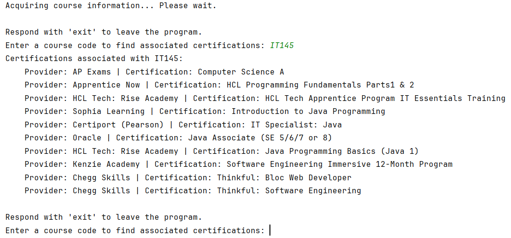

#  SNHU-Shortcut
I was very frustrated with the SNHU certificate page because it organized everything by provider.
Since it was organized in this way users have to 'hunt and peck' for certificates that cover classes
they're looking to take outside of SNHU. With this program you can execute the py file to pull and 
organize all the certificates from SNHU's public API provider. The program will provide you with a prompt
for a course code (ie. IT145 in this format). It may take a few moments for the program to go through all
the certifcates in the catalog so please be patient.Once a valid course code is provided a returned list of all
certifcates that tranfer in as that class will be provided. My hope for this project is to enable students
with the information needed to quickly make decisions about their education. I'd hope to turn this terminal
script into a functioning site because this will further lower the bar for who can access this information.
Currently you'd need to know how to execute a python file to access the information which is beyond some
users.

In future developements I'll make the course information that's aquired saved to the local machine so aquiring
a list will only happen on a 24hr bases instead of on every execution.

### Terminal example

